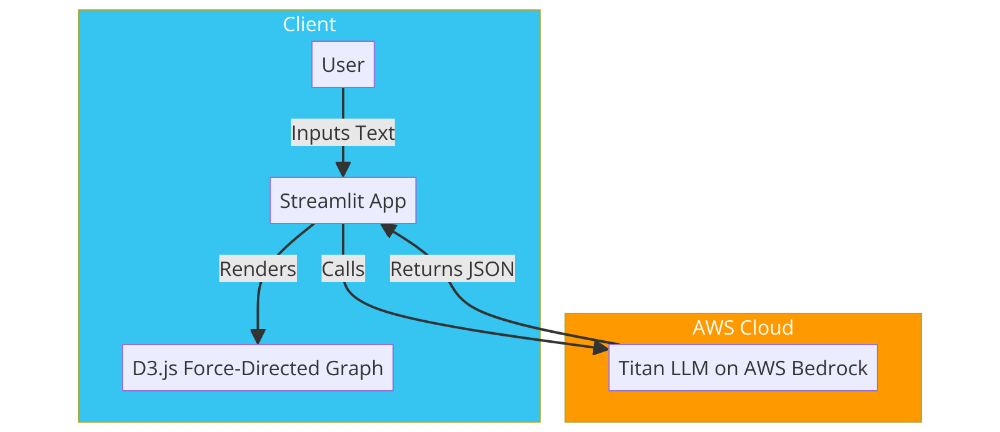
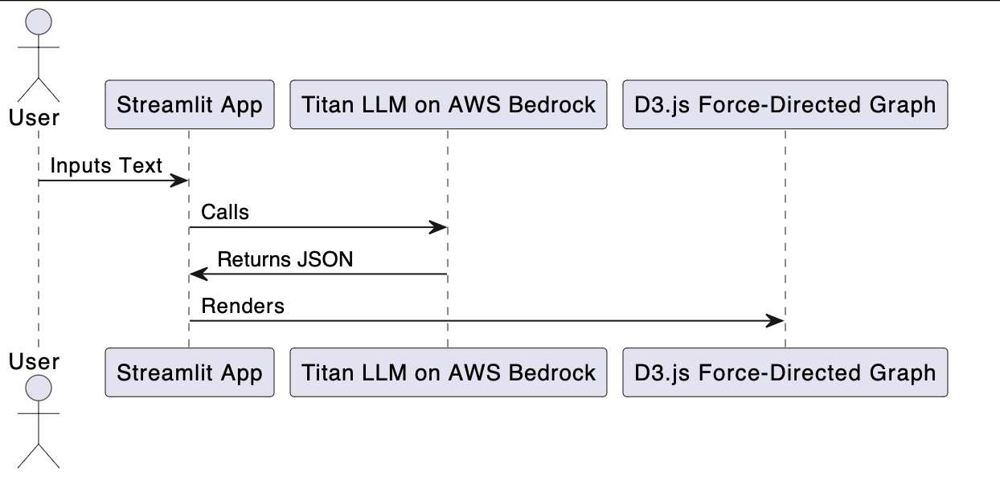

# Serverless Text Analysis Application Using AWS and LLM

## Overview

This application leverages serverless architecture on AWS to analyze large bodies of text using a Large Language Model (LLM) to extract structured knowledge. It identifies objects, entities, locations, and their relationships, presenting the analysis in a D3.js force-directed graph for intuitive visualization.

## Application Logic

1. **User Interaction**: The application utilizes a Streamlit Python frontend where users can input text through a chat module. This module has a memory buffer to maintain the context of the conversation.
2. **LLM Integration**: Upon receiving text input, the Streamlit app invokes a Titan LLM model hosted on AWS Bedrock runtime. The model is prompted to analyze the text and structure the findings in a JSON format suitable for rendering a D3.js force-directed graph.
3. **Data Visualization**: The JSON output from the LLM, detailing entities, relationships, and their attributes, is then used by the Streamlit application to render a dynamic, interactive force-directed graph using D3.js.

## Diagrams

### Conceptual Architecture Diagram

The following is an high-level conceptual diagram that depicts the flow:

### Sequence Diagram

The following is the sequence diagram for the high-level logic:

