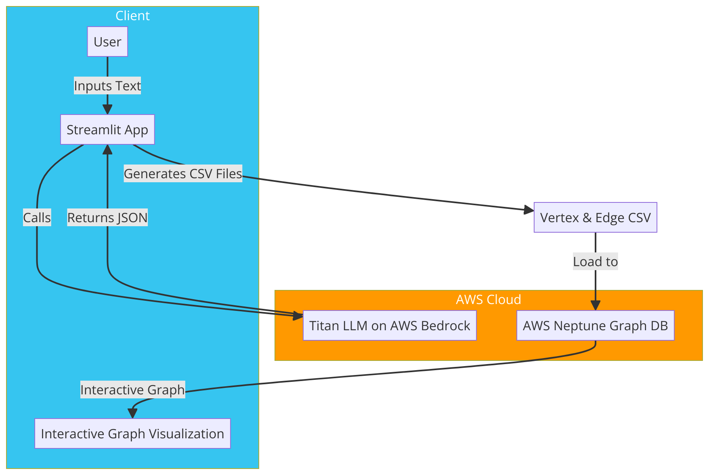
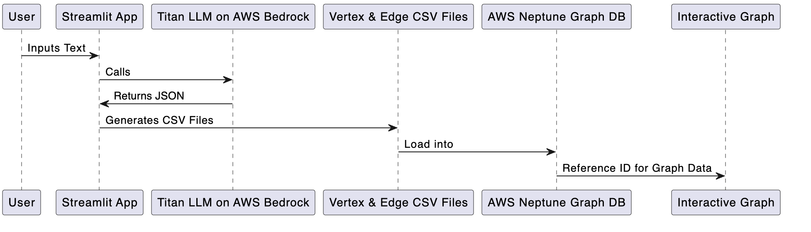

# Serverless Text Analysis Application with AWS

## Overview

This application leverages a serverless architecture on AWS to accept a large body of text from the user and extracts structured knowledge. It identifies objects, entities, locations, and their relationships from the given unstructured text using a Large Language Model (LLM). The structured knowledge is then converted to Apache TinkerPop Gremlin data format to render the knowledge as a graph for visualization.

## Application Logic

1. **User Input**: A Streamlit Python application provides the user interface, accepting text input through a chat module. The chat module includes a memory buffer to remember the conversation history.
2. **LLM Processing**: Upon receiving the user's text, the Streamlit application invokes a Titan LLM model hosted on AWS Bedrock runtime. The model is provided with a prompt to extract entities and relationships in a structured JSON format, suitable for graph representation.
3. **JSON Processing**: The JSON output from the LLM, containing the identified entities and relationships, is processed to generate two CSV files:

   - **Vertex CSV**: Contains `id` and `label` for each entity. Entities can have multiple labels, separated by semicolons.
   - **Edge CSV**: Contains `id`, `from`, `to`, and `label` for each relationship. Each relationship is represented by a single label.
4. **Graph Visualization**: The CSV files serve as input to construct a graph in Apache TinkerPop Gremlin format, allowing for the visualization of the extracted knowledge as an interactive graph.
5. **Reference**: More information regarding Amazon Neptune Gremlin Data Format can be found here: [Gremlin Data Format](https://docs.aws.amazon.com/neptune/latest/userguide/bulk-load-tutorial-format-gremlin.html)

## Conceptual Architecture Diagram

The following is the conceptual architecture diagram for MVP2:

## Sequence Diagram

The following is the sequence diagram for MVP2:

<!-- TODO: Insert the sequence diagram here -->
